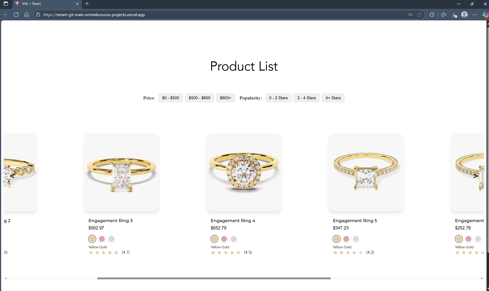
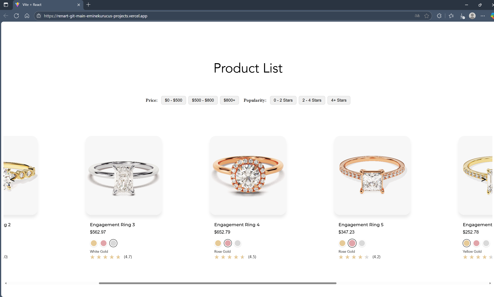
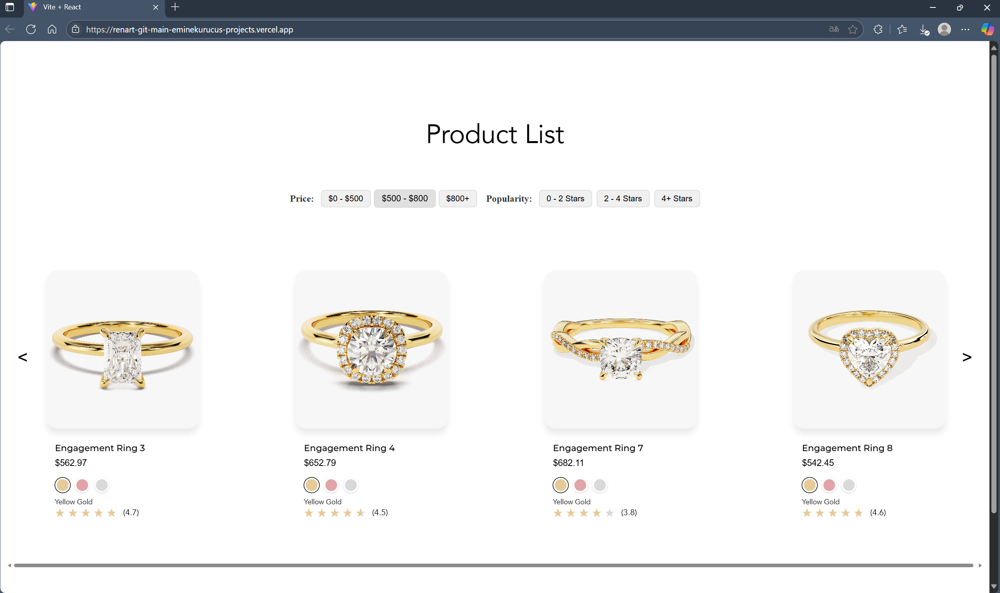
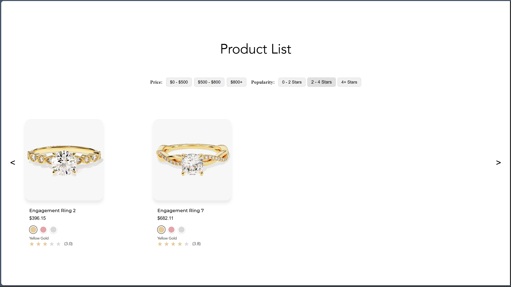

# Tek Sayfalık E-Ticaret Web Sitesi

Bu proje, Node.js ve React teknolojilerini kullanarak geliştirilmiş dinamik bir e-ticaret web uygulamasıdır. Ürün verileri JSON formatında saklanmakta ve dış bir API'den (GoldAPI) alınan altın fiyatlarına göre ürün fiyatları gerçek zamanlı olarak hesaplanmaktadır.

##  Özellikler

- Tek sayfalık modern web tasarımı
- JSON dosyasından gelen ürün verilerinin listelenmesi
- Altın fiyatlarının dış API (GoldAPI.io) ile alınması
- Fiyat ve popülerliğe göre filtreleme seçenekleri
- Scroll ile yatay ürün listeleme

##  Kullanılan Teknolojiler

### Frontend
- React (Vite)
- HTML, CSS
- Axios ile API bağlantısı

### Backend
- Node.js
- Express.js
- JSON dosyasından veri okuma
- GoldAPI ile canlı veri çekme

### Site Canlı Yayın Linki
[Canlı Website Linki](renart-git-main-eminekurucus-projects.vercel.app)

### Fotoğraflar

### Farklı Renk Seçenekleri

### $500 Üzeri Olanların Sıralanması

### 3 Yıldız Üzeri Olanların Sıralanması

